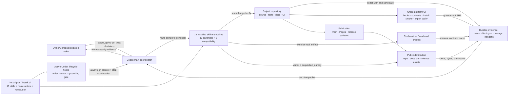
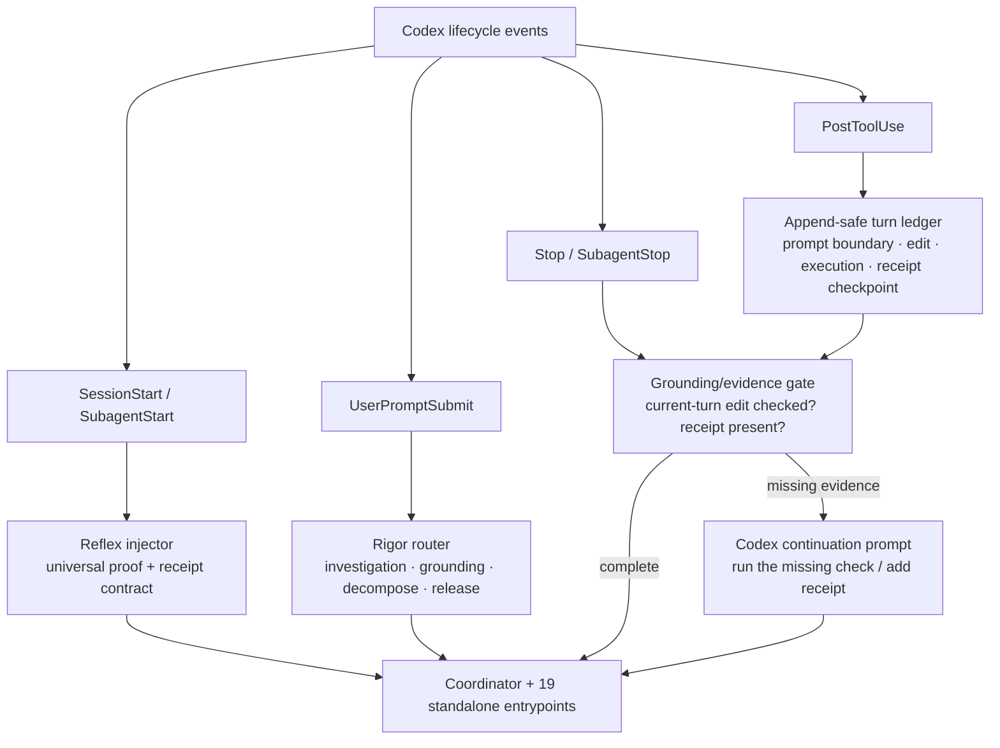
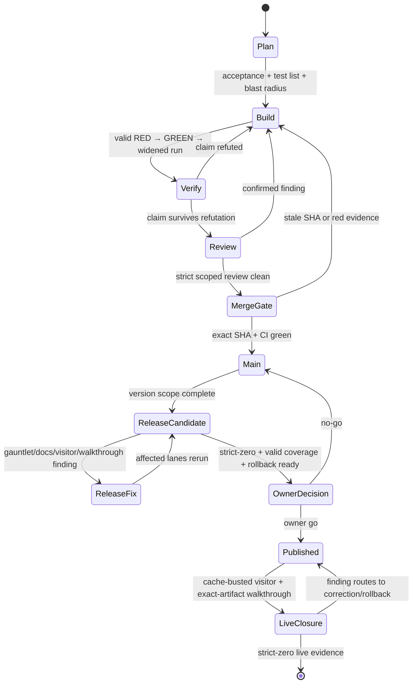
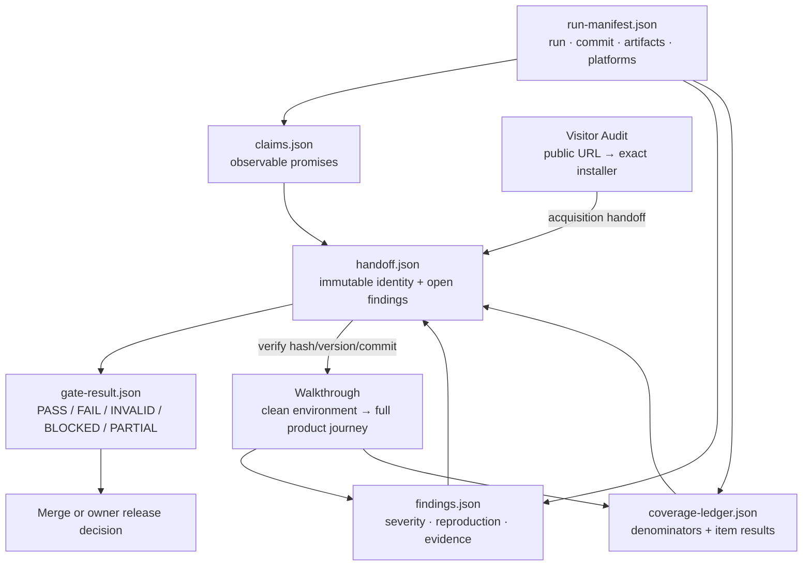
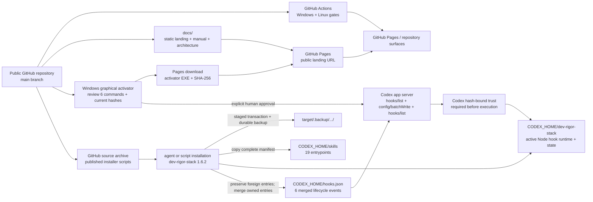

# codex-dev-rigor-stack — technical architecture

**Architecture version:** 1.6.2

**Applies to dev-rigor-stack:** 1.6.2

This document describes the system boundaries, delivery state machine, evidence flow, and
deployment model. The [user manual](MANUAL.md) explains operation; this document explains
how the parts compose and where trust changes hands.

## Architectural principles

1. **Evidence is typed by claim.** Source inspection cannot prove runtime, UI, installer,
   or public-distribution claims.
2. **Worker is not judge.** Build, adversarial verification, review, and release judgment
   are separated by role or fresh context.
3. **Blast radius sets depth.** Review rigor follows impact, not diff size.
4. **Artifacts keep identity.** Commit SHA, installer hash, environment, coverage, and
   handoff identity remain stable across gates.
5. **Capability does not silently degrade.** Missing required siblings or evidence make a
   gate INVALID; they do not authorize a compact approximation.
6. **External value stays owner-controlled.** Tagging, publishing, destructive external
   actions, spending, and risk acceptance remain human decisions unless explicitly authorized.

## System context

The package is not a build system or test framework. It is an orchestration and evidence
discipline layered over the tools a repository already uses. The coordinator keeps
judgment; specialized skills provide complete standalone protocols.

## Active Codex enforcement architecture

The active Codex hook layer is a first-class runtime boundary:

`Stop` and `SubagentStop` are the authoritative mechanical boundary. `UserPromptSubmit`
records a turn boundary; an accepted coding receipt records a checkpoint. The gate inspects
only activity after the latest boundary or checkpoint, so an old edit cannot poison later
conversation. Within that scope, append order still matters: a test run before a later code
edit cannot clear the later edit, and an explicitly failed execution cannot clear it.
Codex's `stop_hook_active` field is honored as the platform anti-loop guard. Session and
prompt hooks inject the complete operating contract; PostToolUse supplies observable grounding.
Codex requires users to review and trust non-managed hook definitions. Each command binds
its definition to the runtime script SHA-256, verifies a single read buffer, and compiles
that same buffer; it never hashes one read and executes a second. On Windows, the
graphical Desktop activator supplies that missing client surface: it lists the exact six
owned definitions, requires human confirmation, writes only their current hashes through
Codex's app server, and re-lists them before it can report success. Installed but
untrusted hooks are not active enforcement.
The event and trust behavior follow the
[official Codex hooks contract](https://learn.chatgpt.com/docs/hooks).

## Delivery state machine

The per-unit loop and release gate operate at different altitudes. Every change uses the
unit loop. The aggregate version uses the release gate once the integration line is ready.

## Skill composition

| Layer | Canonical skill | Complete responsibility |
| --- | --- | --- |
| Coordinate | `dev-rigor-stack` | Route unit/release stages and preserve gate invariants |
| Continuity | `dev-rigor-stack-continuity` | Restore and persist cross-session decisions |
| PLAN | `dev-rigor-stack-plan` | Acceptance, tests, blast radius, routing |
| BUILD | `dev-rigor-stack-build` | Full TDD/QA contract and evidence receipt |
| VERIFY | `dev-rigor-stack-proof-gate` | Claim refutation and anti-theater proof |
| REVIEW | `dev-rigor-stack-audit-lite` | Fast scoped independent review |
| REVIEW | `dev-rigor-stack-audit-team` | Five-role high-blast review |
| PRODUCT | `dev-rigor-stack-walkthrough` | Blind acquisition, installer lifecycle, complete UI/UX/wiring coverage |
| PUBLIC | `dev-rigor-stack-visitor-audit` | Rendered public surfaces, controls, assets, claims, acquisition handoff |
| ADVANCE | `dev-rigor-stack-gauntletgate` | Lite/walkthrough/full advancement verdict |
| MERGE | `dev-rigor-stack-merge-gate` | Exact-SHA green-path decision |
| DOCS | `dev-rigor-stack-docs-gate` | README/manual/architecture/landing truth and completeness |
| RELEASE | `dev-rigor-stack-release` | Candidate-to-live strict-zero closure |

Compatibility skills preserve their full contracts: `coder-tdd-qa`, `proof-gate`,
`audit-lite`, `audit-team`, `gauntletgate`, and `visitor-audit`.

## Evidence and handoff architecture

Evidence is additive. A downstream stage may add proof but may not rewrite upstream
findings, coverage, or artifact identity. Coverage is valid only when every inventoried
item resolves to tested, blocked, unverifiable, or explicitly excluded with a reason.

### Visitor/Walkthrough trust boundary

Visitor Audit owns discovery through download. Walkthrough owns the downloaded artifact
through installation and product lifecycle. The boundary record contains product page,
release page, installer URL, platform, version, filename, bytes, checksum/signature,
requirements, install claims, and unresolved questions. Substituting a local build breaks
the public-newcomer claim and makes the run INVALID.

## Deployment architecture

The script installers stage all 19 managed folders, the active hook runtime, and the merged
`hooks.json`, then commit or roll back that set together. They back up
replaced copies and changed hook configuration, and merge only owned entries. Node.js is a
runtime requirement for the hooks; no package dependencies are installed. Codex reloads
skill metadata after restart and executes non-managed hooks only after Codex records the
reviewed current hashes. The Windows activator never edits `config.toml` directly; it uses
the same `hooks/list` and `config/batchWrite` contract as Codex's own hook-review client.

## Runtime and failure boundaries

- **Missing skill or evidence:** gate result is INVALID, not a weaker pass.
- **Confirmed defect:** finding routes to the owning BUILD scope and affected gates rerun.
- **Host-generated checker noise:** classify out only with fetched evidence; do not change
  correct product behavior to satisfy a false positive.
- **Unsafe external action:** mark blocked unless explicitly authorized; never omit it.
- **Stale commit/artifact:** merge/release gate rejects the evidence packet.
- **Live publication defect:** keep rollback readiness active and route to correction or
  the defined rollback decision.

## Security boundaries

The installed artifact is Markdown skill content plus a small Node.js lifecycle runtime.
Installers write managed skill/runtime folders, owned `hooks.json` entries, append-safe
state, and timestamped backups. The hook runtime uses Node built-ins only and introduces no
network service, credential store, or application endpoint. Corrupt or structurally
unexpected hook configuration is refused and left byte-identical.

## Version model

Version `1.6.2` continues the product lineage from `1.5.1`. The interim `1.0.0` Codex
package number remains historical changelog data, not a new lineage root. Subsequent
versions advance monotonically from 1.6.0. Version 1.6.1 repaired Desktop activation;
1.6.2 repairs Stop-hook turn scoping and checkpoint state.

## Provenance note

The original Claude Code hook source is retained under `plugin/` for traceability and
regression comparison. It is not loaded by Codex and is not part of the active runtime
diagram above. The active implementation is independently adapted to the documented Codex
event, payload, trust, and continuation contracts under `codex/`.
