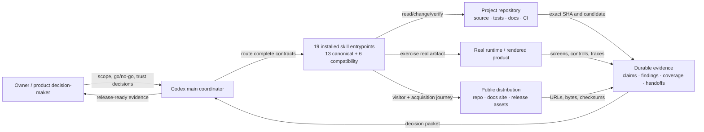
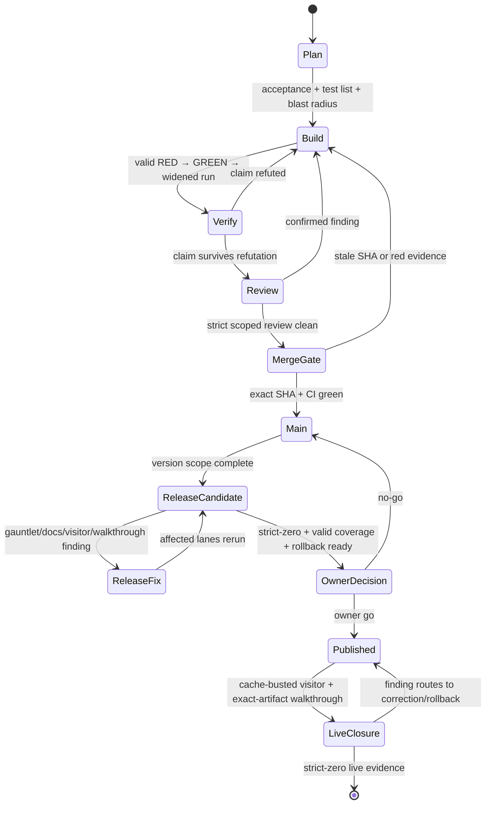
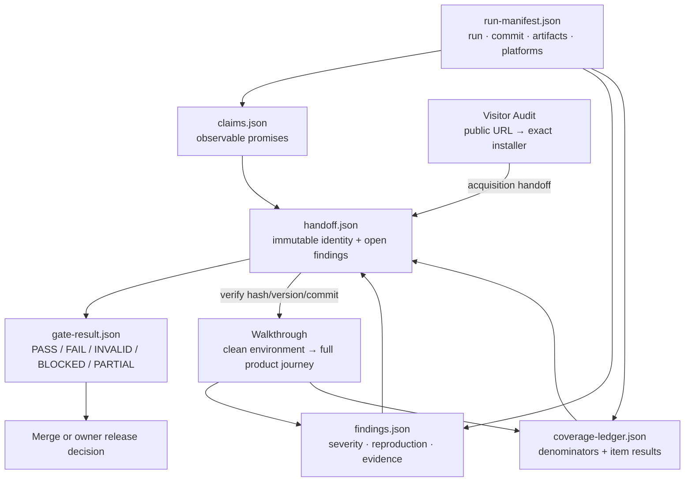
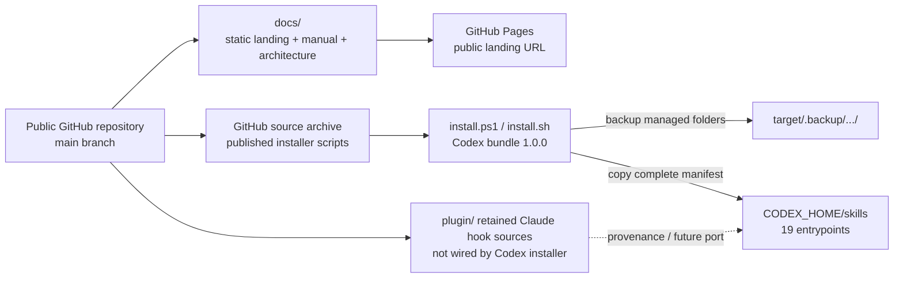

# codex-dev-rigor-stack — technical architecture

**Architecture version:** 1.0.0

**Applies to Codex bundle:** 1.0.0

**Bundled upstream discipline:** 1.5.1

This document describes the system boundaries, delivery state machine, evidence flow, and
deployment model. The [user manual](MANUAL.md) explains operation; this document explains
how the parts compose and where trust changes hands.

## Architectural principles

1. **Evidence is typed by claim.** Source inspection cannot prove runtime, UI, installer,
   or public-distribution claims.
2. **Worker is not judge.** Build, adversarial verification, review, and release judgment
   are separated by role or fresh context.
3. **Blast radius sets depth.** Review rigor follows impact, not diff size.
4. **Artifacts keep identity.** Commit SHA, installer hash, environment, coverage, and
   handoff identity remain stable across gates.
5. **Capability does not silently degrade.** Missing required siblings or evidence make a
   gate INVALID; they do not authorize a compact approximation.
6. **External value stays owner-controlled.** Tagging, publishing, destructive external
   actions, spending, and risk acceptance remain human decisions unless explicitly authorized.

## System context

The package is not a build system or test framework. It is an orchestration and evidence
discipline layered over the tools a repository already uses. The coordinator keeps
judgment; specialized skills provide complete standalone protocols.

## Delivery state machine

The per-unit loop and release gate operate at different altitudes. Every change uses the
unit loop. The aggregate version uses the release gate once the integration line is ready.

## Skill composition

| Layer | Canonical skill | Complete responsibility |
| --- | --- | --- |
| Coordinate | `dev-rigor-stack` | Route unit/release stages and preserve gate invariants |
| Continuity | `dev-rigor-stack-continuity` | Restore and persist cross-session decisions |
| PLAN | `dev-rigor-stack-plan` | Acceptance, tests, blast radius, routing |
| BUILD | `dev-rigor-stack-build` | Full TDD/QA contract and evidence receipt |
| VERIFY | `dev-rigor-stack-proof-gate` | Claim refutation and anti-theater proof |
| REVIEW | `dev-rigor-stack-audit-lite` | Fast scoped independent review |
| REVIEW | `dev-rigor-stack-audit-team` | Five-role high-blast review |
| PRODUCT | `dev-rigor-stack-walkthrough` | Blind acquisition, installer lifecycle, complete UI/UX/wiring coverage |
| PUBLIC | `dev-rigor-stack-visitor-audit` | Rendered public surfaces, controls, assets, claims, acquisition handoff |
| ADVANCE | `dev-rigor-stack-gauntletgate` | Lite/walkthrough/full advancement verdict |
| MERGE | `dev-rigor-stack-merge-gate` | Exact-SHA green-path decision |
| DOCS | `dev-rigor-stack-docs-gate` | README/manual/architecture/landing truth and completeness |
| RELEASE | `dev-rigor-stack-release` | Candidate-to-live strict-zero closure |

Compatibility skills preserve their full contracts: `coder-tdd-qa`, `proof-gate`,
`audit-lite`, `audit-team`, `gauntletgate`, and `visitor-audit`.

## Evidence and handoff architecture

Evidence is additive. A downstream stage may add proof but may not rewrite upstream
findings, coverage, or artifact identity. Coverage is valid only when every inventoried
item resolves to tested, blocked, unverifiable, or explicitly excluded with a reason.

### Visitor/Walkthrough trust boundary

Visitor Audit owns discovery through download. Walkthrough owns the downloaded artifact
through installation and product lifecycle. The boundary record contains product page,
release page, installer URL, platform, version, filename, bytes, checksum/signature,
requirements, install claims, and unresolved questions. Substituting a local build breaks
the public-newcomer claim and makes the run INVALID.

## Deployment architecture

The installers are intentionally simple, dependency-free copy operations. They install all
19 managed folders, back up replaced copies by default, and never activate the retained
Claude hook layer. Codex reloads skill metadata after restart.

## Runtime and failure boundaries

- **Missing skill or evidence:** gate result is INVALID, not a weaker pass.
- **Confirmed defect:** finding routes to the owning BUILD scope and affected gates rerun.
- **Host-generated checker noise:** classify out only with fetched evidence; do not change
  correct product behavior to satisfy a false positive.
- **Unsafe external action:** mark blocked unless explicitly authorized; never omit it.
- **Stale commit/artifact:** merge/release gate rejects the evidence packet.
- **Live publication defect:** keep rollback readiness active and route to correction or
  the defined rollback decision.

## Security boundaries

The installed Codex artifact is Markdown skill content. Installers write managed skill
folders and timestamped backups. The retained Node hook sources use built-ins only but are
not configured by the Codex installer. No new network service, credential store, runtime
dependency, or application endpoint is introduced by installation.

## Version model

Codex bundle `1.0.0` packages upstream discipline `1.5.1`. The immediately previous Codex
bundle was `0.2.0`. Package and methodology versions advance independently and are carried
as separate fields in `manifest.json`.
